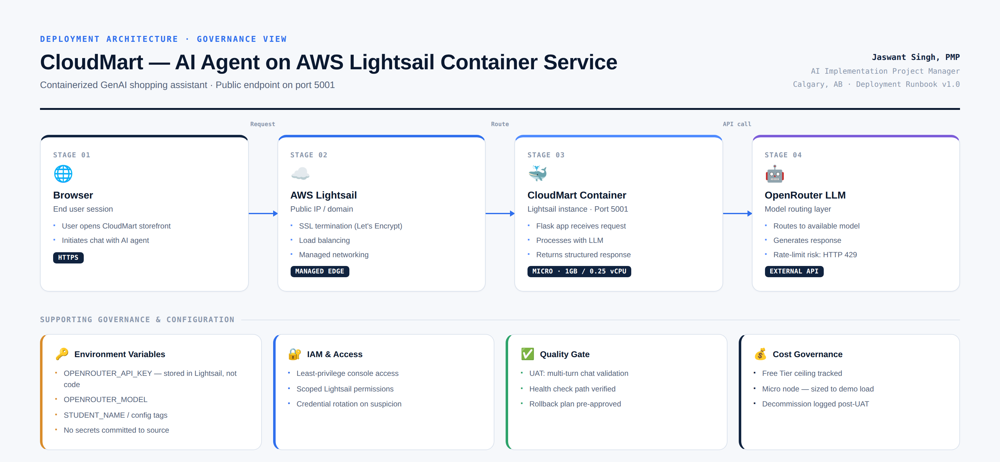

# CloudMart — AI Agent Deployment on AWS Lightsail

**Role:** AI Implementation Project Manager (self-directed, hands-on delivery)
**Status:** Delivered · Validated · Decommissioned per cost-governance plan
**Stack:** AWS Lightsail Container Service · Docker · OpenRouter API · Environment-based secrets management

---

## Overview

CloudMart is a containerized GenAI shopping assistant deployed to **AWS Lightsail Container Service**, exposing a public endpoint for a conversational AI agent that handles customer queries (hours, promotions, product info) in real time.

This repo documents the deployment **as a governed delivery**, not just a technical walkthrough. The container image and application code were provided (K21Academy lab environment); the work captured here is the project management layer that would sit around any real-world deployment of this kind — charter, risk log, RACI, quality gate, and cost governance.

The goal: show what "production-ready" looks like from a PM's seat, not just an engineer's.

---

## Architecture

**Flow:** Browser → AWS Lightsail (SSL termination, load balancing) → CloudMart Container (Flask app, port 5001) → OpenRouter LLM (model routing) → response returned to user.

**Supporting governance layer:** environment-variable-based secrets, least-privilege IAM, a UAT quality gate, and cost tracking against AWS Free Tier limits.

---

## Deliverables

This project was run against a standard delivery checklist rather than a single "deploy and done" step:

| Deliverable | Purpose | Link |
|---|---|---|
| 📋 Project Charter | Scope, success criteria, stakeholder sign-off | [docs/project-charter.md](docs/project-charter.md) |
| ⚠️ RAID Log | Risks, assumptions, issues, dependencies | [docs/raid-log.md](docs/raid-log.md) |
| 🧩 RACI Matrix | Ownership across Dev / PM / Security | [docs/raci-matrix.md](docs/raci-matrix.md) |
| 📘 Deployment Runbook | Step-by-step config + rollback plan | [docs/deployment-runbook.md](docs/deployment-runbook.md) |
| 🚨 Incident Runbook | Known failure modes + mitigations | [docs/incident-runbook.md](docs/incident-runbook.md) |
| ✅ UAT / Test Evidence | Functional validation before go-live | [docs/uat-evidence.md](docs/uat-evidence.md) |
| 💰 Cost & Decommission Log | Free Tier tracking, teardown record | [docs/cost-and-decommission.md](docs/cost-and-decommission.md) |

---

## What This Demonstrates

- **Governance discipline applied to a technical deployment** — nothing shipped without a RACI and a rollback plan
- **Secure configuration management** — API keys handled via Lightsail's native environment variable store, never hardcoded
- **Risk-first thinking** — the OpenRouter rate-limit failure mode (HTTP 429) was documented *before* it occurred, with ranked mitigations
- **Cost accountability** — capacity was sized to actual demo load (Micro node) rather than defaulted upward, and resources were torn down and logged post-validation

---

## Background

Built on a hands-on lab from [K21Academy](https://k21academy.com), guided by Atul Kumar. The lab provided the container image and application code; the project management artifacts, risk framing, and governance documentation in this repo are original work.

---

## About Me

**Jaswant Singh, PMP** — AI Implementation Project Manager, transitioning from retail operations and project coordination (The Brick, Michael Hill, Mobil) into AI/cloud delivery. Based in Calgary, AB — open to remote roles across Canada.

[LinkedIn](https://linkedin.com/in/jaswant-singh-pmp/) · [GitHub](https://github.com/JaswantOnGit)
